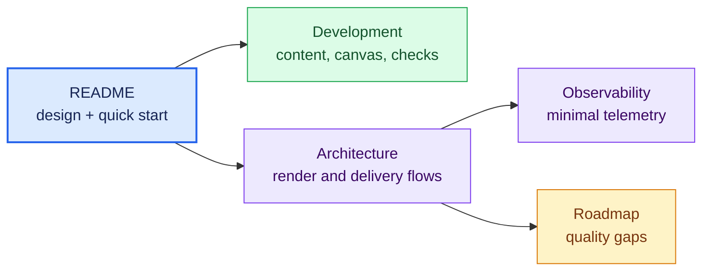

# Documentation index

`me` is a small static Astro site. The documentation stays intentionally
compact while still covering the character-art renderer, privacy boundary,
deployment, maintenance workflow, and known gaps.

| Document | Use it when |
| --- | --- |
| [`../README.md`](../README.md) | You need the design intent, quick start, or deployment summary |
| [`development.md`](development.md) | You are changing copy, links, rendering, metadata, or build configuration |
| [`architecture.md`](architecture.md) | You need page composition, the Nocturne pipeline, delivery, or failure behavior |
| [`observability.md`](observability.md) | You are verifying minimized Sentry/PostHog behavior or rotating release credentials |
| [`roadmap.md`](roadmap.md) | You need the current quality and maintenance gaps |
| [`../CONTRIBUTING.md`](../CONTRIBUTING.md) | You are preparing a change |
| [`../SECURITY.md`](../SECURITY.md) | You need to report a vulnerability privately |
