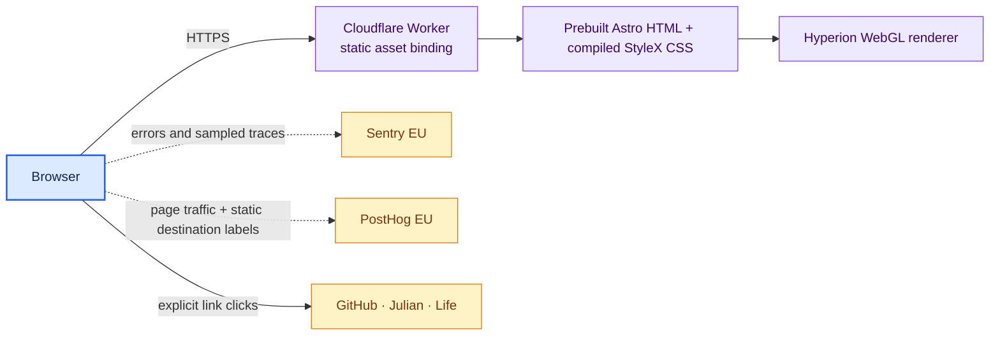
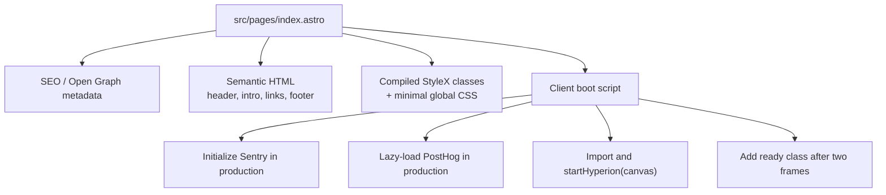
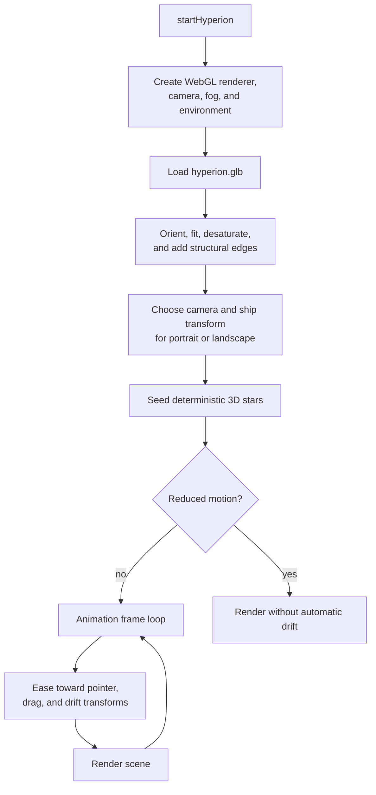
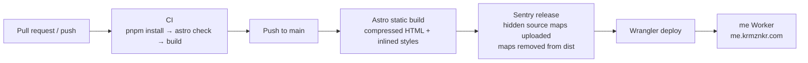

# Architecture

`me` is a static Astro site with one page and a client-side Three.js scene.
Astro produces the document shell, metadata, styles, and link content at build
time; the browser loads the Hyperion model, runs its animation, and initializes
production-only observability integrations.

## System context

There is no API, server-side rendering at request time, database,
authentication, or user-generated content. The Cloudflare Worker serves only
the contents of `dist/`.

## Page composition

The meaningful text and links are present in the initial HTML. StyleX compiles
the page tokens, layout, responsive rules, and element interaction states into
atomic CSS at build time. `global.css` is limited to document-wide resets,
cross-element reveal state, and generated icon geometry. JavaScript adds the
decorative canvas, telemetry, outbound-link events, and staggered reveal; the
content does not depend on those enhancements.

## Hyperion render pipeline

### Geometry and lifecycle

- Device pixel ratio is capped at 1.75 on desktop and 1.35 on small screens.
- The model is oriented from its longest axis, centered, fitted to a stable
  scene length, and rendered with restrained metallic materials and edge lines.
- The random star field uses a fixed seed, so its composition is deterministic.
- Resize changes the camera and ship transform for portrait or landscape.
- Animation pauses while the document is hidden and resumes when visible.
- `prefers-reduced-motion` disables drift, and a visible control lets other
  visitors pause or resume it.
- Pointer position adds subtle parallax; dragging directly rotates the model.
- The returned handle removes listeners, cancels the frame, and disposes the
  renderer, even though the current one-page lifecycle does not call it.

## Build and deployment

The `site` value in `astro.config.mjs` supplies canonical URL generation.
`workers_dev` is disabled, so the site is exposed only at its custom domain.
The shared platform Terraform redirects `krmznkr.com` to that domain.

### Configuration and secrets

| Value | Purpose | Exposure |
| --- | --- | --- |
| `SENTRY_AUTH_TOKEN` | Release creation and source-map upload | GitHub Actions build only |
| `SENTRY_RELEASE` | Commit-SHA release name | Build-time metadata |
| `CLOUDFLARE_API_TOKEN` | Wrangler authentication | GitHub Actions only |
| Sentry DSN | Browser ingestion | Public identifier in bundle |
| PostHog project token | Browser ingestion | Public identifier in bundle |

Local builds normally receive none of the secret build variables, so they
generate no Sentry release and no source maps.

## Observability boundary

Sentry initializes only in production and captures browser errors and sampled
traces; session replay is disabled. PostHog uses its slim browser build with
persistence, identification, autocapture, recording, heatmaps, surveys, and
feature flags disabled. Current and referrer URLs are reduced to origin plus
pathname.

The only custom event is `outbound_link_clicked`. It sends one static
`destination` label (`github`, `julian`, `life`, or `source`) from an explicitly
tagged anchor; it does not send link text or URL as a custom property. See
[`observability.md`](observability.md) for the complete controls and runbooks.

## Failure behavior

| Failure | Result |
| --- | --- |
| JavaScript disabled or canvas unavailable | All text and links remain; the decorative scene is absent |
| Model or WebGL initialization fails | The dark CSS atmosphere remains behind the content |
| Reduced motion requested | The 3D scene renders without automatic drift |
| Tab hidden | Animation frame loop pauses |
| Sentry/PostHog unavailable | Page and canvas continue |
| Deploy workflow fails | Previous Cloudflare Worker deployment remains active |

## Where to change things

| Change | Primary files |
| --- | --- |
| Copy, links, metadata, semantic structure | `src/pages/index.astro` |
| Design tokens, layout, responsive and element states | `src/styles/home.stylex.ts` |
| Global reset, reveal orchestration and icon geometry | `src/styles/global.css` |
| Ship, stars, lighting, motion, and responsive composition | `src/scripts/hyperion.ts`, `public/models/hyperion.glb` |
| Error/performance monitoring | `src/scripts/sentry.ts` |
| Traffic and outbound-link analytics | `src/scripts/posthog.ts` |
| Build output and source maps | `astro.config.mjs` |
| Custom-domain deployment | `wrangler.jsonc`, `.github/workflows/deploy.yml` |
