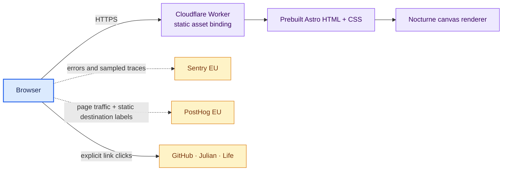
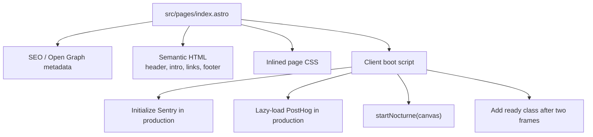
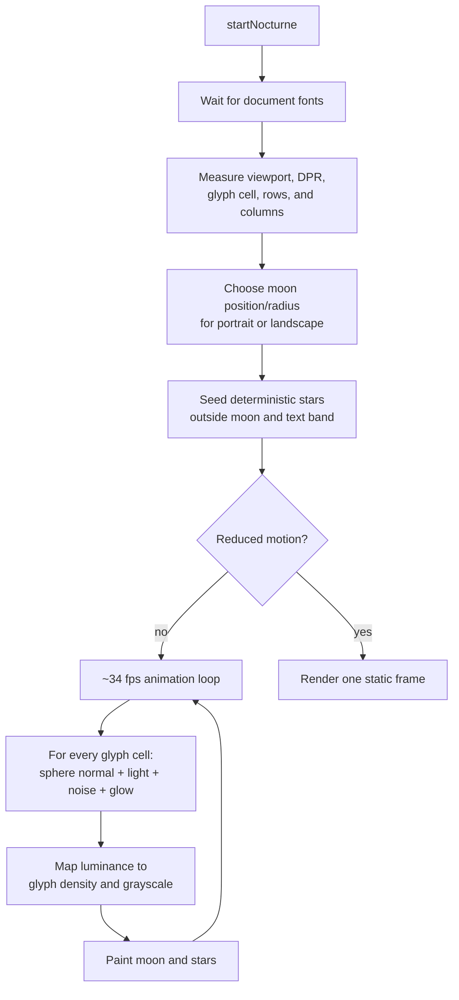
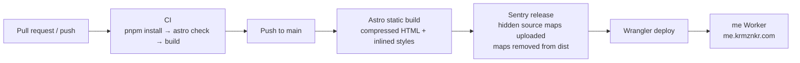

# Architecture

`me` is a static Astro site with one page and a small client-side character-art
renderer. Astro produces the document shell, metadata, styles, and link content
at build time; the browser runs the moon animation and production-only
observability integrations.

## System context

There is no API, server-side rendering at request time, database,
authentication, or user-generated content. The Cloudflare Worker serves only
the contents of `dist/`.

## Page composition

The meaningful text and links are present in the initial HTML. JavaScript adds
the decorative canvas, telemetry, outbound-link events, and staggered reveal;
the content does not depend on those enhancements.

## Nocturne render pipeline

### Geometry and lifecycle

- Canvas backing dimensions are device-pixel-ratio aware, capped at DPR 2.
- Moon geometry is calculated in CSS pixels, so the subject stays circular even
  though monospace cells are taller than they are wide.
- The random star field uses a fixed seed, making recomposition deterministic
  for the same grid dimensions.
- A debounced resize rebuilds the grid, moon composition, and star field.
- Animation pauses while the document is hidden and resumes when visible.
- A `prefers-reduced-motion` change switches between the loop and a static
  frame.
- The returned cleanup function removes listeners and cancels the frame, even
  though the current one-page lifecycle never needs to call it.

## Build and deployment

The `site` value in `astro.config.mjs` supplies canonical URL generation.
`workers_dev` is disabled, so the site is exposed only at its custom domain.
The shared platform Terraform redirects `krmznkr.com` to that domain.

### Configuration and secrets

| Value | Purpose | Exposure |
| --- | --- | --- |
| `SENTRY_AUTH_TOKEN` | Release creation and source-map upload | GitHub Actions build only |
| `SENTRY_RELEASE` | Commit-SHA release name | Build-time metadata |
| `CLOUDFLARE_API_TOKEN` | Wrangler authentication | GitHub Actions only |
| Sentry DSN | Browser ingestion | Public identifier in bundle |
| PostHog project token | Browser ingestion | Public identifier in bundle |

Local builds normally receive none of the secret build variables, so they
generate no Sentry release and no source maps.

## Observability boundary

Sentry initializes only in production and captures browser errors and sampled
traces; session replay is disabled. PostHog uses its slim browser build with
persistence, identification, autocapture, recording, heatmaps, surveys, and
feature flags disabled. Current and referrer URLs are reduced to origin plus
pathname.

The only custom event is `outbound_link_clicked`. It sends one static
`destination` label (`github`, `julian`, `life`, or `source`) from an explicitly
tagged anchor; it does not send link text or URL as a custom property. See
[`observability.md`](observability.md) for the complete controls and runbooks.

## Failure behavior

| Failure | Result |
| --- | --- |
| JavaScript disabled or canvas unavailable | All text and links remain; the decorative scene is absent |
| Web font load fails | Canvas measures and renders with its monospace fallback |
| Reduced motion requested | One static character-art frame |
| Tab hidden | Animation frame loop pauses |
| Sentry/PostHog unavailable | Page and canvas continue |
| Deploy workflow fails | Previous Cloudflare Worker deployment remains active |

## Where to change things

| Change | Primary files |
| --- | --- |
| Copy, links, metadata, layout, styling | `src/pages/index.astro` |
| Moon, star, noise, motion, and responsive composition | `src/scripts/nocturne.ts` |
| Error/performance monitoring | `src/scripts/sentry.ts` |
| Traffic and outbound-link analytics | `src/scripts/posthog.ts` |
| Build output and source maps | `astro.config.mjs` |
| Custom-domain deployment | `wrangler.jsonc`, `.github/workflows/deploy.yml` |
