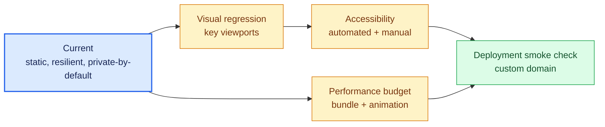

# Roadmap and known gaps

The site is intentionally small and feature-complete. The useful remaining work
is quality assurance and maintenance, not product expansion.

| Priority | Gap | Suggested outcome |
| --- | --- | --- |
| Next | No visual regression coverage | Capture stable phone, desktop, ultrawide, and reduced-motion states without freezing intentional shimmer |
| Next | No automated accessibility check | Validate landmarks, heading order, links, contrast, canvas fallback, and keyboard use |
| Next | No explicit performance budget | Track JavaScript size, font cost, canvas frame time, and long tasks so the page stays quiet and lightweight |
| Later | No post-deploy smoke check | Confirm the custom domain, canonical metadata, security headers, and main links after deployment |
| Later | Renderer logic is largely integration-tested by sight | Extract deterministic geometry/luminance helpers only where tests improve confidence without distorting the design code |

Implementation detail belongs in GitHub issues when an item is selected. The
current architecture and privacy behavior are documented in
[`architecture.md`](architecture.md) and [`observability.md`](observability.md).
