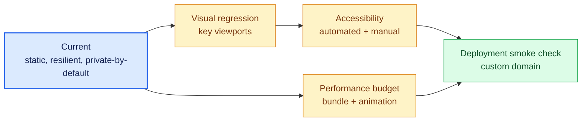

# Roadmap and known gaps

The site is intentionally small and feature-complete. The useful remaining work
is quality assurance and maintenance, not product expansion.

```mermaid
flowchart LR
  baseline["Current<br/>static, resilient, private-by-default"]
  visual["Visual regression<br/>key viewports"]
  a11y["Accessibility<br/>automated + manual"]
  perf["Performance budget<br/>bundle + animation"]
  smoke["Deployment smoke check<br/>custom domain"]

  baseline --> visual --> a11y
  baseline --> perf
  a11y --> smoke
  perf --> smoke

  classDef done fill:#dbeafe,stroke:#2563eb,color:#172554,stroke-width:2px
  classDef next fill:#fef3c7,stroke:#d97706,color:#78350f
  classDef later fill:#dcfce7,stroke:#16a34a,color:#14532d
  class baseline done
  class visual,a11y,perf next
  class smoke later
```

| Priority | Gap | Suggested outcome |
| --- | --- | --- |
| Next | No pixel-baseline regression coverage | Browser checks now capture phone, laptop, ultrawide, reduced-motion and no-JavaScript review images; establish baselines only when they improve confidence |
| Next | No automated accessibility check | Validate landmarks, heading order, links, contrast, canvas fallback, and keyboard use |
| Next | No explicit performance budget | Track JavaScript size, font cost, canvas frame time, and long tasks so the page stays quiet and lightweight |
| Done | Post-deploy smoke check | Deploy verifies the custom domain, canonical metadata, links, headers, model and root redirect |
| Later | Renderer logic is largely integration-tested by sight | Extract deterministic geometry/luminance helpers only where tests improve confidence without distorting the design code |

Implementation detail belongs in GitHub issues when an item is selected. The
current architecture and privacy behavior are documented in
[`architecture.md`](architecture.md) and [`observability.md`](observability.md).
